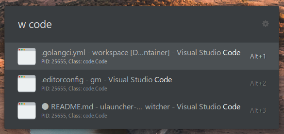

# X11 Window Switcher for Ulauncher

This plugin is a window switcher for Ulauncher. Works under X11 environment.

**Does not work in Wayland environment.**

Search by title or class(WM_CLASS).



## Requirements

- `wmctrl`

### Install

#### Debian/Ubuntu

```shell
sudo apt install -y wmctrl
```

#### Fedora

```shell
sudo dnf install -y wmctrl
```